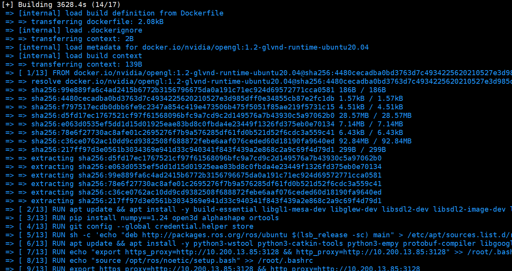

# nvidia-ros-docker

This repo provides a minimal working example of an NVIDIA GPU enabled
ROS Noetic container.

comes from: https://github.com/helmifraser/nvidia-ros-docker
## Prerequisites

Ensure the following are installed on your host. Instructions may vary depending on your host OS.

1. [Docker](https://docs.docker.com/engine/install/ 'Docker').
2. NVIDIA drivers.
3. [NVIDIA Container Toolkit](https://docs.nvidia.com/datacenter/cloud-native/container-toolkit/install-guide.html 'NVIDIA Container Toolkit')

So far this only been tested on Linux machines.

## Usage

1. Build the image. By default the example targets the name `hf/nvidia-ros-noetic`.

    ```
    docker build -t hf/nvidia-ros-noetic .
    ```

2. Edit `.env` environment variable definitions as needed. For example, if the
    built image has the name `user/example-image`, change:
    
    ```
    IMAGE=hf/nvidia-ros-noetic
    ```

    to:

    ```
    IMAGE=user/example-image
    ```

    By default, this repo's `data` folder is mounted in the `bag` and `rviz` containers
    under `/host`. `bag` will look for a rosbag file named `test.bag` in there to play.

3. start the new container:
    ```
    bash docker_run.sh
    ```
4. Start the examples, either via the example `compose-up` file:

    ```
    ./compose-up
    ```

    or manually, targeting `docker-compose.yaml`:

    ```
    docker-compose --env-file .env up
    ```

    Additional configuration for GUIs may be needed depending on your configuration.
    The ROS tutorial [here](https://wiki.ros.org/docker/Tutorials/GUI) may be a good
    place to start.

    Because I'm "lazy and reckless", I have  simply adjusted the permissions for the
    X server host in `compose-up` prior to launching, reverting when done. Generally,
    **this isn't a good idea**.  

## Comments by Rogue
### Its fking slow
just keep patience:  

### Install NVIDIA container toolkit first!
